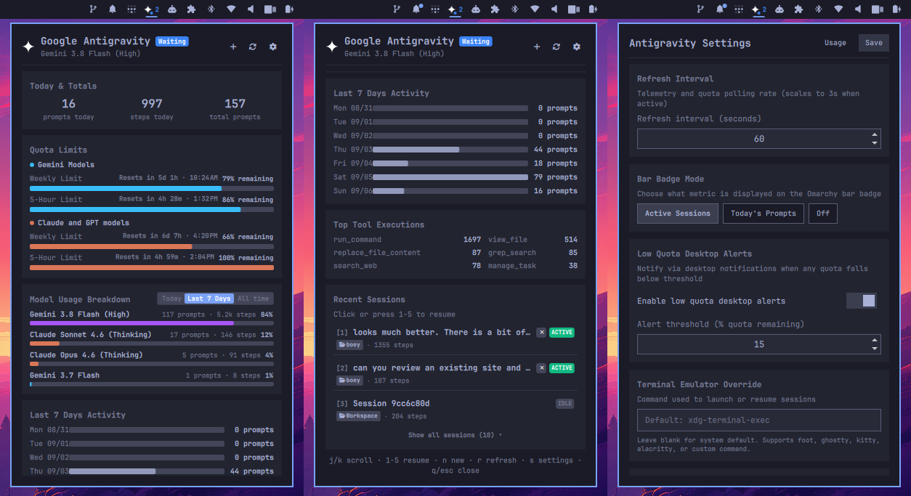

# Antigravity Usage for Omarchy

Antigravity active session monitor, prompt metrics, tool telemetry, and 7-day usage stats in the Omarchy top bar.



## Features

- **Live Status & Pulse**: Visual status indicator (pulsing green/blue dot) in the Omarchy bar showing when an Antigravity agent is active, working, or idle.
- **Prompt & Step Counters**: Prompts today, steps today, and all-time totals.
- **7-Day Activity Chart**: Visual bar chart of prompt volume over the last 7 days with hover tooltips.
- **Tool Telemetry Breakdown**: Live counter of tool calls (`run_command`, `write_to_file`, `replace_file_content`, `view_file`, `grep_search`, `find_by_name`, `subagents`, etc.).
- **Active & Recent Sessions**: Preview of current tasks, workspace names, step progress, and session status.
- **Dual Omarchy Integration**:
  1. Standalone Bar Widget with rich QML popup modal (`jesseburlamaque.antigravity-usage`).
  2. Native Omarchy Agents panel collector (`bin/omarchy-agent-usage-antigravity`).

## Requirements

- Python 3 (standard library: `sqlite3`, `json`, `datetime`, `pathlib`, `collections`)
- Google Antigravity (`agy` CLI / IDE) with local session data in `~/.gemini/antigravity-cli`
- Omarchy Shell / Quickshell

## Installation

```sh
omarchy plugin add https://github.com/jesseburlamaque/antigravity-usage.git --enable
```

### (Optional) Native `omarchy.agents` Panel Integration

To also include Antigravity as a tab inside Omarchy's built-in Agents panel:

```sh
mkdir -p ~/.local/bin
ln -sf ~/.config/omarchy/plugins/jesseburlamaque.antigravity-usage/bin/omarchy-agent-usage-antigravity ~/.local/bin/omarchy-agent-usage-antigravity
```

## Interactions

- **Left Click**: Open/close popup panel with stats, charts, and recent sessions.
- **Middle Click**: Force immediate refresh of telemetry data.
- **Right Click**: Open in-popup settings view.
- **Keyboard Shortcuts**:
  - `Esc`: Close popup.
  - `r`: Refresh data.
  - `s`: Toggle between Stats and Settings view.

## Configuration

Configuration lives in `~/.config/omarchy/shell.json`.

| Key | Type | Default | Description |
|---|---|---|---|
| `refreshIntervalSec` | integer (10–1800) | `60` | Telemetry refresh rate in seconds |
| `showBadge` | boolean | `true` | Show prompt count badge in the bar widget |

## License

MIT © Jesse Burlamaque
